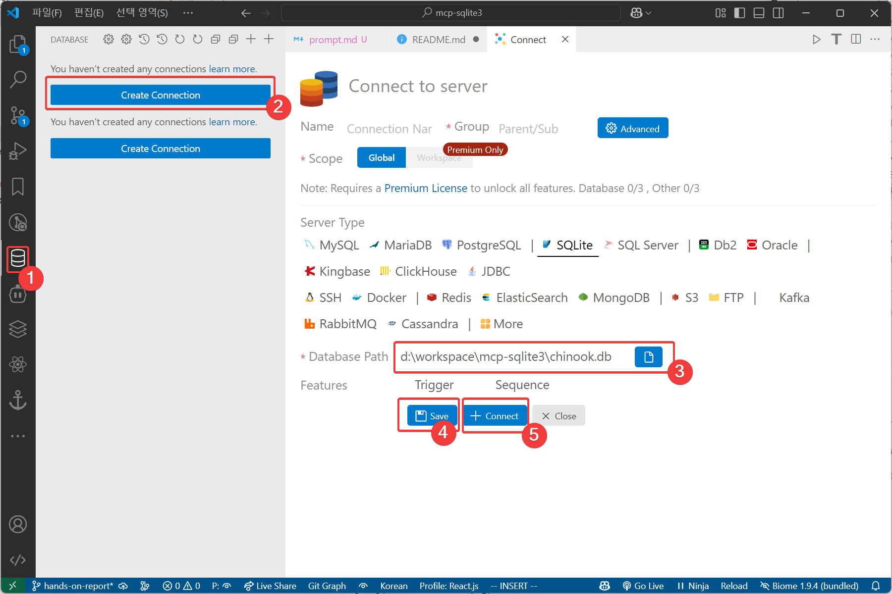
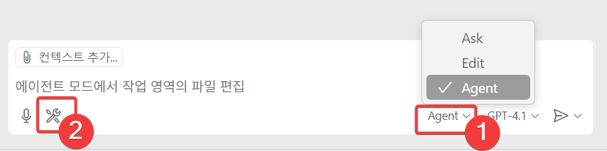
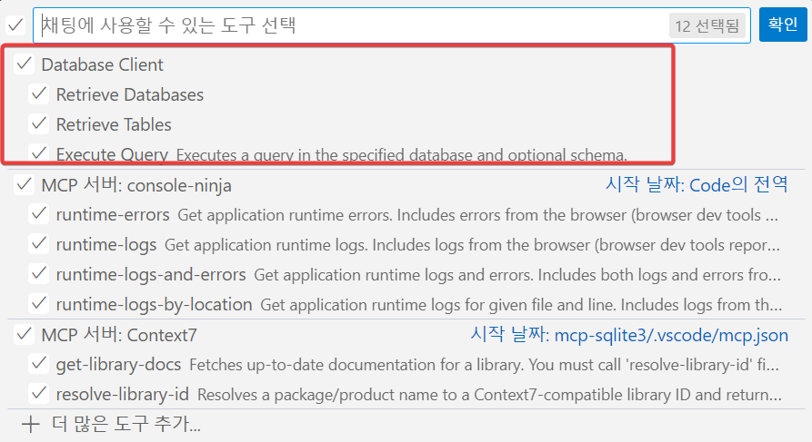
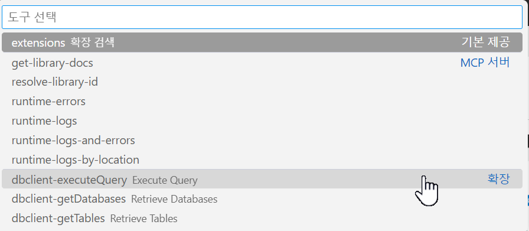

## 데이터베이스 연결



## MCP 연결

ChatGpt 창에서 `agent 모드 ①`를 선택 합니다.

그리고, model 중에서 추천하는 모델은 'Claude 3.7 Sonnet'입니다.
claude로 에이전트를 사용 할 때 가장 지속적으로 작업을 오래 해 줍니다
다른 모델을 사용 하셔도 됩니다.

`도구 선택 ②`을 하면 아래와 같은 다이얼로그가 나옵니다.


여기서 Database Client가 나오면 작업을 시작 할 수 있습니다.


## 실습 #1
`Ctrl+/`를 누르고나 `컨텍스트 추가`버튼을 눌러 줍니다.

도구 > dbclient-excuteQuery를 선택합니다



프롬프트를 아래와 같이 넣어 줍니다.

```

```
