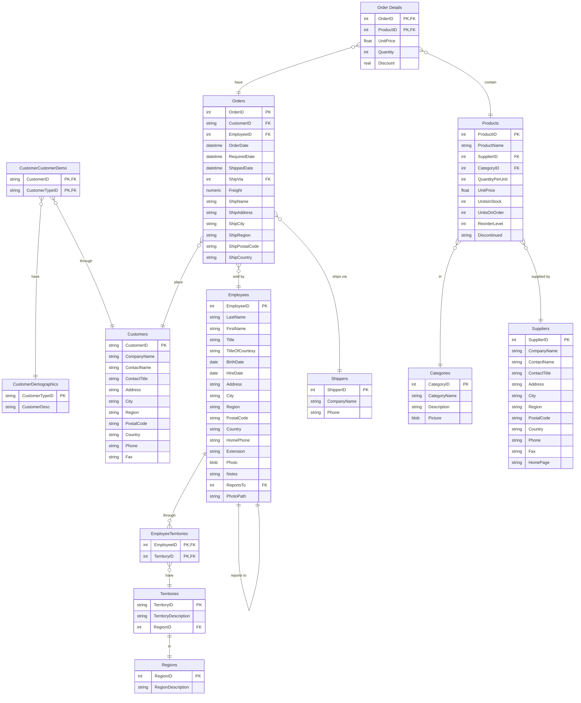

# sqlite 샘플 데이터베이스

## 1.사킬라 데이터베이스
Sakila 샘플 데이터베이스는 MySQL AB 문서 팀의 전 멤버인 Mike Hillyer에 의해 처음 개발되었습니다. 이는 책, 튜토리얼, 기사, 샘플 등에서 사용될 수 있는 표준 스키마를 제공하기 위한 것입니다.

사킬라 데이터베이스
최고의 예제 데이터베이스 중 하나는 사킬라 데이터베이스로, 원래 MySQL에 의해 생성되었으며 BSD 라이선스의 조건 하에 오픈 소스화되었습니다.

Sakila는 비디오 대여점 체인을 위한 데이터베이스를 모델링합니다. 여기에는 다음에 대한 방대한 정보가 포함되어 있습니다:

 - 영화 제목
 - 배우, 장르 등
 - 어떤 상점이 어떤 영화를 재고로 보유하고 있는지
 - 거래 및 지불
 - 고객
 - 직원

### The Sakila Database ERD


데이터베이스는 다음과 같이 가장 많은 영화를 가진 배우를 찾는 멋진 예제 쿼리를 허용합니다 (PostgreSQL 구문):

```sql
SELECT first_name, last_name, count(*) films
FROM actor AS a
JOIN film_actor AS fa USING (actor_id)
GROUP BY actor_id, first_name, last_name
ORDER BY films DESC
LIMIT 1;
```
 

```
first_name    last_name    films
--------------------------------
GINA          DEGENERES       42
```

또는, 모든 매장의 누적 수익을 계산해 보겠습니다 (PostgreSQL 구문):

```sql
SELECT payment_date, amount, sum(amount) OVER (ORDER BY payment_date)
FROM (
  SELECT CAST(payment_date AS DATE) AS payment_date, SUM(amount) AS amount
  FROM payment
  GROUP BY CAST(payment_date AS DATE)
) p
ORDER BY payment_date;
```
 
```table
payment_date       amount         sum
-------------------------------------
2005-05-24          29.92       29.92
2005-05-25         573.63      603.55
2005-05-26         754.26     1357.81
2005-05-27         685.33     2043.14
2005-05-28         804.04     2847.18
2005-05-29         648.46     3495.64
2005-05-30         628.42     4124.06
2005-05-31         700.37     4824.43
2005-06-14          57.84     4882.27
2005-06-15        1376.52     6258.79
2005-06-16        1349.76     7608.55
2005-06-17        1332.75     8941.30
...
```
사킬라 데이터베이스로 놀고 싶으신가요? 우리는 GitHub에서 원본 데이터베이스의 여러 포팅 버전을 호스팅하고 있으며, 다음과 같은 버전이 포함되어 있습니다:

- DB2
- MySQL
- 오라클
- PostgreSQL
- SQL Server
- SQLite

원본 출처 : https://github.com/bradleygrant/sakila-sqlite3

## 2. Chinook 데이터베이스
치누크는 SQL Server, Oracle, MySQL 등에서 사용할 수 있는 샘플 데이터베이스입니다. 단일 SQL 스크립트를 실행하여 생성할 수 있습니다. 치누크 데이터베이스는 Northwind 데이터베이스의 대안으로, 단일 및 다중 데이터베이스 서버를 대상으로 하는 ORM 도구의 데모 및 테스트에 이상적입니다.

### 지원되는 데이터베이스 서버
- DB2
- MySQL
- 오라클
- PostgreSQL
- SQL Server
- SQL Server Compact
- SQLite

### 데이터 모델
Chinook 데이터 모델은 아티스트, 앨범, 미디어 트랙, 송장 및 고객을 포함하는 디지털 미디어 상점을 나타냅니다.


### 샘플 데이터
미디어 관련 데이터는 iTunes 라이브러리의 실제 데이터를 사용하여 생성되었습니다. 자신의 iTunes 라이브러리를 사용하여 SQL 스크립트를 생성할 수 있으며, 아래의 지침을 참조하세요. 고객 및 직원 정보는 허구의 이름, 구글 지도에서 찾을 수 있는 주소 및 잘 정리된 기타 데이터(전화, 팩스, 이메일 등)를 사용하여 수동으로 생성되었습니다. 판매 정보는 4년 기간 동안 무작위 데이터를 사용하여 자동 생성됩니다.

### 왜 Chinook라는 이름인가?
이 샘플 데이터베이스의 이름은 Northwind 데이터베이스를 기반으로 했습니다. Chinook은 북미 내륙의 바람으로, 캐나다 평원과 대평원이 다양한 산맥과 만나는 지역입니다. Chinook은 캐나다의 남부 앨버타에서 가장 많이 발생합니다. Chinook은 Northwind에 대한 대안이 되고자 하는 데이터베이스에 잘 어울리는 이름 선택입니다.


원본 출처 : https://github.com/lerocha/chinook-database

## Northwind-SQLite3
이는 Microsoft Access 2000 Northwind 샘플 데이터베이스의 버전으로, SQLite3에 맞게 재구성되었습니다.

Northwind 샘플 데이터베이스는 Microsoft Access와 함께 제공되어 소규모 비즈니스 고객, 주문, 재고, 구매, 공급업체, 배송 및 직원을 관리하기 위한 튜토리얼 스키마로 사용되었습니다. Northwind는 고객, 주문, 재고, 구매, 공급업체, 배송, 직원 및 단일 입력 회계와 함께 소규모 비즈니스 ERP를 위한 훌륭한 튜토리얼 스키마입니다.

MSSQL-2000 버전의 모든 테이블과 뷰가 Sqlite3로 변환되어 여기 포함되어 있습니다. 데이터로 미리 채워진 단일 버전이 포함되어 있습니다. 원하신다면 포함된 파이썬 스크립트를 사용하여 데이터베이스에 더 많은 데이터를 추가할 수 있습니다.

### 구조
# Structure


### Views

| View Name | 뷰 이름 |  
|-----------|-------|
| [Alphabetical list of products] | [제품의 알파벳 목록] |
| [Current Product List] | [현재 제품 목록] |[현재 제품 목록] |
| [Customer and Suppliers by City] | [도시별 고객 및 공급업체] |
| [Invoices] |[송장] |
| [Orders Qry] |[주문 조회] |
| [Order Subtotals] |[주문 소계] |
| [Product Sales for 1997] |[1997년 제품 판매] |
| [Products Above Average Price] |[평균 가격 이상의 제품] |
| [Products by Category] |[카테고리별 제품] |
| [Quarterly Orders] |[분기별 주문] |
| [Sales Totals by Amount] |[금액별 판매 총계] |
| [Summary of Sales by Quarter] |[분기별 판매 요약] |
| [Summary of Sales by Year] |[연도별 판매 요약] |
| [Category Sales for 1997] |[1997년 카테고리 판매] |
| [Order Details Extended] |[주문 세부정보 확장] |
| [Sales by Category] |[카테고리별 판매] |

원본 출처: https://github.com/jpwhite3/northwind-SQLite3


